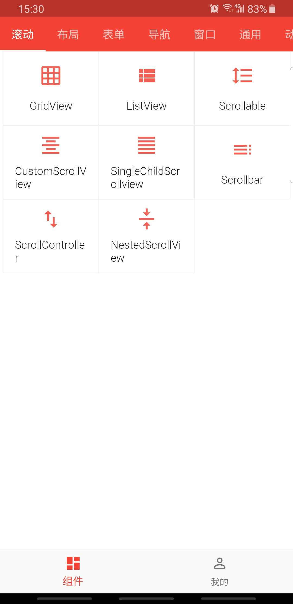
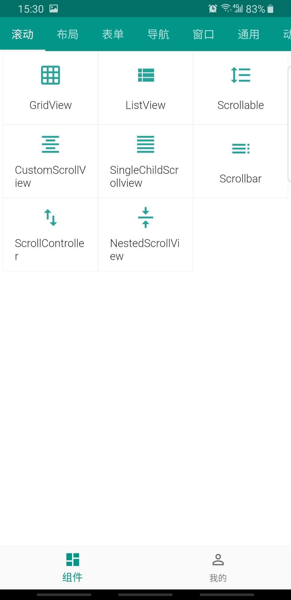
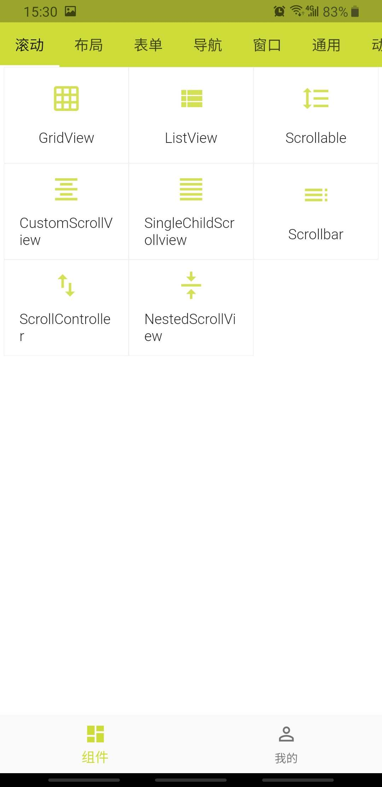
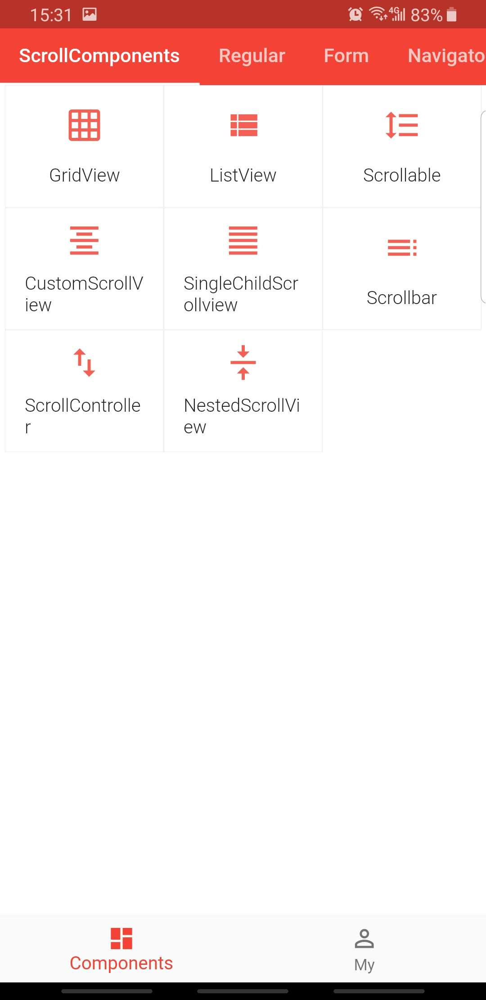
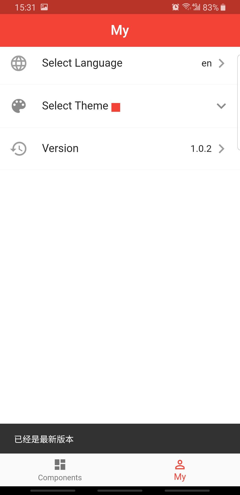
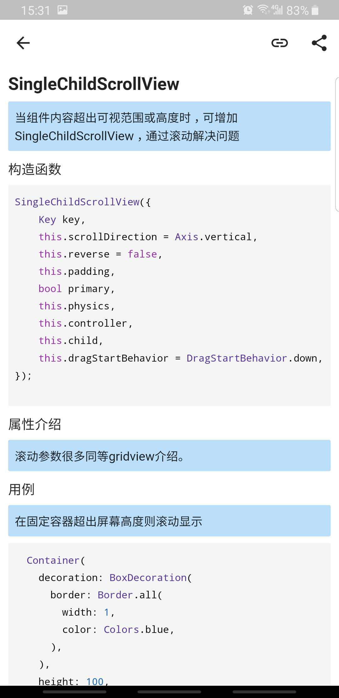

#  Flutter UI  v1.0.2

> flutter 开发者社区
## 功能清单  
+ widget 组件教程
+ 多语言切换
+ 多主题切换
+ 自动更新检测  
+ firebase 崩溃监控
  
## apk 下载
   
[安卓包下载](https://github.com/efoxTeam/flutter-ui/releases/download/v1.0.2/app-release.apk)

## Demo 预览 
    
  

## 项目相关
+ [apk包历史版本](https://github.com/efoxTeam/flutter-ui/releases)
+ [组件开发进度](readme/widget_progress.md)
+ [贡献PR参考](readme/pr.md)

## 项目交流   

